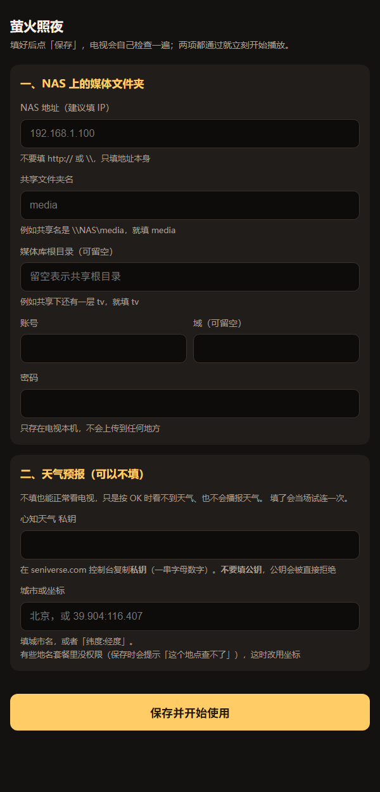

# FireflyTV（萤火照夜）

> 老人便捷媒体播放器：连电视、极简物理按键
>
> 萤火虫不照明整片天，只在夜里静静亮着一小块地方。

为家中老人做的 Android TV 播放软件，**只在局域网内运行**：片源放在自己家的 NAS、轻 NAS、
旧电脑或路由器硬盘上，走通用的 **SMB** 共享直接播放。不联网盘、不要账号、没有广告、没有内容运营。

整机只有三个按键：**左右换媒体库，上下换剧 / 换频道，OK 看天气**。没有列表、没有海报墙、
没有选集页，切完立即播放 —— 因为目标用户是「只会开关电视和换台」的老人。

- **打开就在播**：回到上次那个库、那部剧、那一集、那一分钟接着看（播放中每 5 秒记一次，直接关电视也不丢）
- **每个按键都有反馈**：左下角出一条「《库名》正在打开…」，切库要等 NAS 时不至于像死机
- **出错说人话**：连不上 NAS、片源放不了、直播断了，屏幕上写清楚是什么问题
- **电视上没有 adb 也能排查**：内置播放诊断页，双击遥控器的「设置 / 信息」键就能看解码器、帧率和结论
- **配置只需一次**：电视上出现二维码，手机或电脑打开填一遍，电视自己测通了才开始播
- **会念天气**：按 OK 出浮层（天气 + 时间 + 农历），同时用系统中文 TTS 念一遍；系统没有中文语音时自动退化成只显示文字

## 截图

<p align="center">
  <br>
  <sub>电视上：第一次开机直接出现二维码，手机扫码或照抄那行地址</sub>
</p>

<p align="center">
  <br>
  <sub>手机 / 电脑上：填 NAS（必填）与天气（可选）；点保存时电视会当场各试连一次</sub>
</p>

## 按键

```
   ← →   切换媒体库（循环）
   ↑ ↓   换剧 / 换频道（循环）
   OK    天气 + 时间 + 日历 + 语音播报
   双击「设置 / 信息」键   播放诊断页（OK 关闭，30 秒后也会自动关）
```

切换后**立即播放**。其余按键一律不响应。

> 每次按键都会在画面左下角出一条名字（换库时是「《库名》正在打开…」），
> 让老人知道键收到了、正在换什么。
>
> 诊断页做成「双击」：目标机型的「信息」键实际就是设置键，单击弹一屏字太重，
> 双击既不误触、也不用手记组合键；打开后按 OK 关闭。

## 首次配置

第一次开机（或清掉应用数据后），电视上直接出现二维码和一行地址。手机或电脑打开那个地址，
填两件事：

1. **NAS**（必填）：地址（建议填 IP）、共享文件夹名、可选的媒体库根目录、账号密码。
2. **天气**（可以不填）：心知天气的**私钥**，加上城市名或「纬度:经度」。

点「保存」时电视会**当场各连一次**：NAS 连不上、天气私钥不对，都会把具体原因写回页面上，
全部通过才开始播。所以配置页同时也是一个连通性检查工具。

> 配置页只在「还没配置」时自动出现，没有按键重入路径。要重新配置：
> `adb shell pm clear com.firefly.tv`（或在系统设置里清除应用数据）后再打开应用。
> NAS 密码只存在电视本机；配置服务在保存成功后立即关闭，链接里的一次性 token 随之失效。

## 天气（可选）

用**心知天气（seniverse）**，只要两栏：私钥 + 地点。

- 控制台给的是一对「公钥 / 私钥」，**必须填私钥**：公钥会被接口直接拒绝（`AP010003`）。
- 地点填城市名或「纬度:经度」都收（例如 `北京`、`39.904:116.407`）。
  有些地名在免费套餐里没有权限（`AP010006`），换成坐标一定行。
- **没有默认地点**：两项要么都填、要么都留空（留空 = 电视上不显示天气、也不播报）。

免费套餐按次计费，所以查询有节流：成功结果 **30 分钟**内不再问，失败也要 **5 分钟**冷却
（免得坏 Key 疯狂重试烧配额），结果还落盘 —— 重开电视不算新的一次查询，也不会一开机就是「天气获取中…」。
按这个策略一天最多几十次。

## NAS 上怎么放（平铺的文件也能播）

一个子文件夹 = 一个媒体库，库里两种放法都认：

```
影视\
├── 电视剧\              ← 一个库
│   ├── 娘道\            ← 一部剧（子文件夹）
│   │   └── 01.mp4 ...   ← 剧集
│   └── 大宅门\
└── 测试\                ← 一个库
    ├── BV1cP34zRE33.mp4 ← 平铺的视频文件 = 一部剧（单集）
    └── BV1TuGE6AES8.mp4
```

空库会被跳过，但**转完一圈就停并报故障**，不会几个库一轮一轮地跳个不停。

## 播放诊断页

电视上不方便接 adb，所以把证据直接放到屏幕上 —— **双击遥控器上的「设置 / 信息」键**：

```
屏幕    1920×1080 · dpi 240 · density 1.50 · 缩放 ×1.33 @50.0Hz
画面    3840×2160 · 片源 25.0 帧/秒 → 输出 1920×1080
解码    硬解 OMX.MTK.VIDEO.DECODER.HEVC
帧率    解码 24.6 · 送显 18.2 · 丢帧 0%
像素率  送显 151.2 Mpx/秒（片源要 207.4）
缓冲    41240 毫秒 / 13.9 MB       读取 0.0 MB/秒（要 0.4）
音频    avcodec aac · 已出声
结论    送显 18.2 帧/秒，低于片源的 25.0 帧/秒：解码够快，画面却跟不上，瓶颈在送显/合成（送显 151.2 Mpx/秒）
内容    大宅门
```

- 每行都来自播放器真值，不做推算；取不到的（例如某些流没有 `avg_frame_rate`）显示 0 而不是瞎猜。
- 「画面」那一行**必须带编码**：同一台设备 4K H.264 能满帧、4K HEVC 只有 ~18 帧/秒，
  看不出编码就分不清是「片源太重」还是「编码踩坑」。
- 「结论」那一行是**算出来的**（`PlaybackVerdict`，16 项单元测试），判据按优先级：
  硬解静默回落 → 读取跟不上 → 缓存见底 → 送显低于片源 → 解码跟不上。
- 出过事才会多出两行：`兜底`（静默退回软解次数 / 已被禁用的解码器）。

这一页的来历、以及当年用来量 4K 的那套实验工装，见 [开发记录](docs/DEVLOG.md#诊断页与实验台)。

## 已知限制

- **4K H.265 能不能看，取决于设备自己的硬解能力。** 实测过的一台（长虹 CHiQ 43Q3T / 联发科 MT5520）
  上，4K H.264 能满帧、4K HEVC 只有约 18 帧/秒 —— 瓶颈是那颗芯片的 HEVC 解码块（约 150 Mpx/秒封顶），
  跟片源帧率无关。**实用建议：4K 优先选 H.264 版本；HEVC 就选 1080p，或 2960×2160 那种准 4K。**
  换台设备后，看诊断页的「解码」行就能知道这台行不行。
- **模拟器不能用来做 4K 性能验收。** 模拟器只有软件解码器（ijkplayer 会按排名拒掉），
  4K H.265 到不了 24fps 是环境天花板（32 位 x86 guest + 老的 GL 传输通道）。
  验逻辑、验音频、验切换、验 1080p 都没问题。
- **软件解码需要内核带 SIMD**：ijkplayer 上游给 x86 编的 FFmpeg 是 `--disable-asm`（一条 SIMD 都没有），
  仓库里的构建脚本会先把这个补丁打上。
- **`https://` 的直播源需要内核带 OpenSSL**，官方包和默认自编包都没有，见下面的「播放内核」。

## 构建

> 本机是「WSL 里编辑、Windows 里构建」两头一套源码。跨树构建用
> [`scripts/win-build.sh`](scripts/win-build.sh)：它把 `app/src`、`app/build.gradle.kts`、
> `app/proguard-rules.pro`、`app/libs/*.aar` 同步到 Windows 侧那棵树（`WIN_ROOT=` 必填）再构建，
> 并把产物拷回 `build/apk/`。用法见脚本头部注释。

```powershell
# 离线 / 受限网络下直接用本地缓存的 Gradle 8.11.1（能联网时用 .\gradlew 即可）
.\build.ps1                      # 打 debug APK（模拟器用）
.\build.ps1 assembleRelease      # 打正式包（电视用）
.\build.ps1 testDebugUnitTest    # 单元测试（248 项：农历/节气/缓存/导航/按键反馈/格式判定/解码策略/渲染通路/moov 改写/数据源约定/观看记录/天气策略/界面缩放/选码与 10bit 防线/帧率归因/媒体库结构/直播断流判据）
.\build.ps1 connectedDebugAndroidTest   # 插桩测试（60 项：播放桥接/硬解通路/解码真值/编解码能力探测/轨道探针/配置页/真 NAS 联调/格式实测/SMB 吞吐/直播失败可见性/天气解析）
```

仓库自带 Gradle Wrapper（8.11.1）：联网机器上标准的 `.\gradlew assembleDebug`（Linux / macOS 用 `./gradlew assembleDebug`）同样可用。

> Android SDK 的位置由 `ANDROID_HOME` / `ANDROID_SDK_ROOT` 指定，或在根目录
> `local.properties` 里写一行 `sdk.dir=…`。`build.ps1` 找不到 SDK 时会给出提示。

产物（`release` 与 `debug` **同一个签名**，所以正式包能直接覆盖装在电视上的 debug 包，
不必卸载、配置和观看记录都不会丢）：

| 命令 | 产物 | 体积 |
| :--- | :--- | :--- |
| `.\build.ps1` | `app\build\outputs\apk\debug\app-debug.apk` | ~30 MB（三个 ABI 全带，模拟器 x86 能用） |
| `.\build.ps1 assembleRelease` | `app\build\outputs\apk\release\app-release.apk` | ~25 MB（R8 压缩 + 资源裁剪） |

**正式包做了什么**（`app/build.gradle.kts` + `app/proguard-rules.pro`）：

- R8 压缩 + 摇树 + 资源裁剪；`v/d/i` 三档日志在正式包里被去掉（`w/e` 保留）；
- 签名复用 debug keystore：电视上装的就是 debug 包，换签名会以
  `INSTALL_FAILED_UPDATE_INCOMPATIBLE` 失败，而卸载会连配置一起清掉。
  要换成真正的发布签名，在 `local.properties` 里加 `ff.keystore.*` 四项即可
  （模板见 `local.properties.example`）；
- 三个 ABI 都留在包里 = 同一个 APK 电视和模拟器都能装。只想给电视发小包的话，
  把 `x86` 从 `abiFilters` 去掉可以再减 ~17 MB。

### 播放内核

ijkplayer 官方包自带的 FFmpeg **只编进了 23 个解码器，没有 AC-3、没有 MP2、没有 DTS**，
而常见片源恰好命中这些缺口（AC-3 的剧集、MP2 的央视直播），表现就是「画面好好的，就是没声音」。

所以仓库用的是一份重新编译、把 **AC-3 / E-AC-3 / MP2 / DTS 都打开**（并补上 OpenSSL）的内核：
`app/libs/ijkplayer-full-0.8.8.aar`。它是本地二进制、**不入库**，重建方式见
[`app/libs/README.md`](app/libs/README.md) 与 [开发记录](docs/DEVLOG.md#播放内核与音频格式)。

## 测试与联调

```powershell
# 生成测试素材（插桩测试的示例视频）
.\scripts\make-test-media.ps1

# 一键拉起模拟器：装包 + 启动 + 把内置配置页转发出来
.\scripts\dev-env.ps1
```

想用**自己的真实 NAS** 跑插桩联调，把连接信息填进 `local.properties`
（模板见 `local.properties.example`，该文件已 gitignore，不会入库）。
没填就自动跳过相关测试，不会失败。

### 出问题时先跑这三个诊断

```powershell
# 1) 网络到底通不通（模拟器里 ping 不通是正常的，NAT 不回 ICMP，只有 TCP 能说明问题）
.\build.ps1 connectedDebugAndroidTest -Pandroid.testInstrumentationRunnerArguments.class=com.firefly.tv.diag.NetworkDiagTest
adb logcat -s FireflyDiag

# 2) 每种片源到底能不能播、有没有声音
.\build.ps1 connectedDebugAndroidTest -Pandroid.testInstrumentationRunnerArguments.class=com.firefly.tv.player.FormatMatrixTest
adb logcat -s FireflyFormat

# 3) 这台设备到底能硬解什么：
#    打印每个 video/hevc 解码器的 profileLevels、4K / 4K@60 支持、有没有 COLOR_FormatSurface
.\build.ps1 connectedDebugAndroidTest -Pandroid.testInstrumentationRunnerArguments.class=com.firefly.tv.player.CodecCapabilityProbeTest
adb logcat -s FireflyCodec
```

播放时另外两条日志值得盯：

```powershell
# 实际用的是哪个解码器（电视上期望 MEDIACODEC + OMX.<厂商>.*）
adb logcat -s FireflyTV | Select-String "硬解选码器"

# 这个编码的所有候选解码器 + ijkplayer 给它们的分数
# 设备 SoC 的解码器在 ijkplayer 的已知机型表里没有条目时，会拿 700（= 未知、没测过）
adb logcat -s FireflyTV | Select-String "候选解码器"
```

想单独看某一份片源的容器与编码（会打印大小、容器、moov 位置、轨道清单）：

```powershell
.\build.ps1 connectedDebugAndroidTest -Pandroid.testInstrumentationRunnerArguments.class=com.firefly.tv.player.FormatProbeTest
adb logcat -s FireflyProbe
```

排查 NAS 上的片源结构（尤其是 mp4 的 `moov` 在头还是尾）：

```powershell
$env:PYTHONPATH = '<impacket 安装目录>'
$env:FF_SMB_HOST='192.168.1.100'; $env:FF_SMB_SHARE='media'
$env:FF_SMB_USER='...'; $env:FF_SMB_PASS='...'
python .\scripts\smb-diag.py --limit 10 --probe 8
```

## 安全与隐私

- **只在局域网内跑**：片源走你自己的 SMB 共享；可选的心知天气接口是唯一的公网请求（HTTPS，只带私钥与地点）。
- **没有遥测、没有账号、没有广告**，不上传任何使用数据。
- **NAS 账号密码只存在电视本机**（`SharedPreferences`，`MODE_PRIVATE`，**明文、未加密**；只用于登录你自己填的 SMB 共享，不会上传到任何地方）。
  配置页只在「还没配置」时开服，地址里带一次性随机 token（`SecureRandom`），保存成功后立即关服。
- **正式包复用 debug 签名**（原因见「构建」一节）：debug keystore 是公开的，任何人都能签一个同签名的包。
  请只从本仓库的 Release 安装，或者自己编。
- 本仓库**不含任何影视资源、播放列表或直播源**；片源与直播源请自备，并自行确认来源合法。

## 项目信息

| 项 | 值 |
| :--- | :--- |
| 目录 | `FireflyTV` |
| 包名 | `com.firefly.tv` |
| 目标设备 | 长虹 CHiQ 43Q3T（Android 5.1，Cortex-A53，2GB RAM，4K 面板） |
| 技术栈 | Kotlin + 原生 View + ijkplayer + smbj |
| 最低版本 | Android 5.0（API 21） |

## 文档

- [开发记录](docs/DEVLOG.md) —— 每个真实故障的复现过程、实测数据、源码核对结论（**想知道「为什么这么写」看这里**）
- [方案设计](docs/DESIGN.md) —— 按键、媒体库结构、技术选型、风险清单、实施阶段
- [调研：4K 电视上的 UI 缩放](docs/RESEARCH-4K-TV-SCALING.md) —— 真机上 DisplayMetrics 到底报什么、
  `config_maxUiWidth` 的版本沿革、四种缩放方案对比、官方 10 英尺可读性建议（每条都带来源链接）；
  未经逐条复核的原始材料与更正记录在 [`docs/research/4K-DISPLAY-METRICS-REPORT.md`](docs/research/4K-DISPLAY-METRICS-REPORT.md)
- [调研：ijkplayer 0.8.8 硬解通路](docs/research/ijkplayer-0.8.8-mediacodec-mtk-report.md) ——
  逐行核对源码的选码五道闸、13 种失效模式、完整选项默认值表、哪些选项其实是**空操作**

## 明确不做

刮削、海报墙、选集界面、进度条/暂停界面、返回键功能。

## 许可证

[Apache License 2.0](LICENSE)，版权行见 [NOTICE](NOTICE)。

第三方组件（ijkplayer / FFmpeg / OpenSSL / SDL / libyuv / SoundTouch / smbj / zxing / AndroidX 等）
按各自的协议授权，与 Apache-2.0 无关 —— 完整清单与 LGPL 合规说明见
[THIRD-PARTY-NOTICES.md](THIRD-PARTY-NOTICES.md)。
